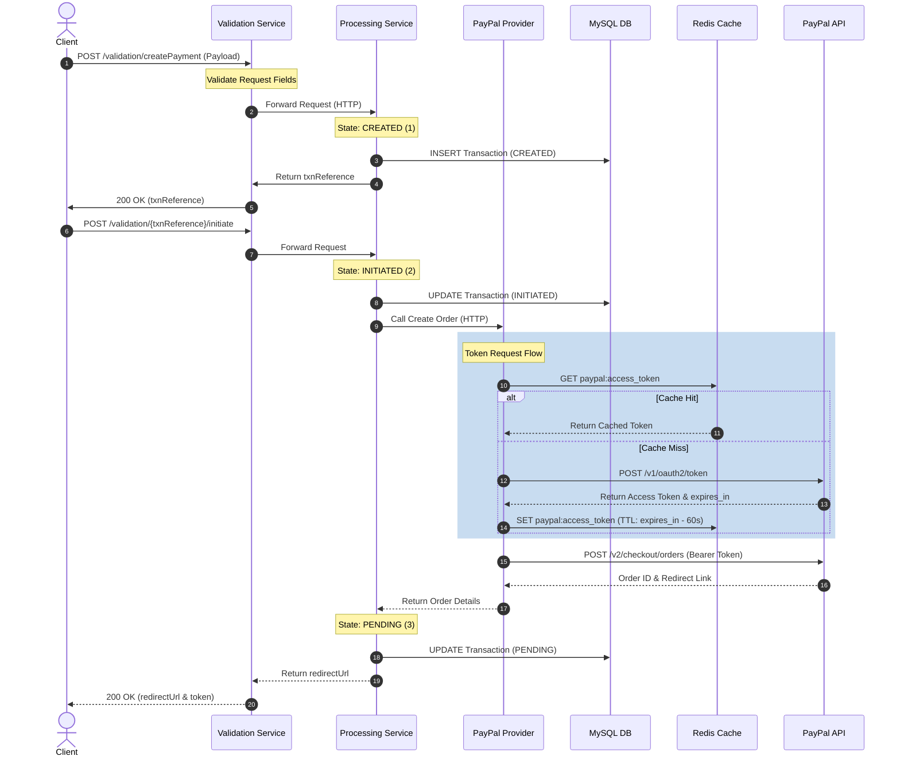
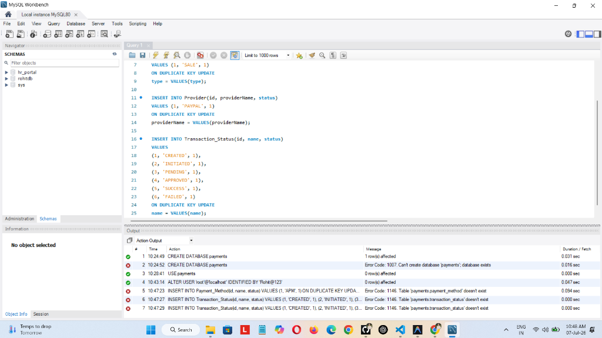
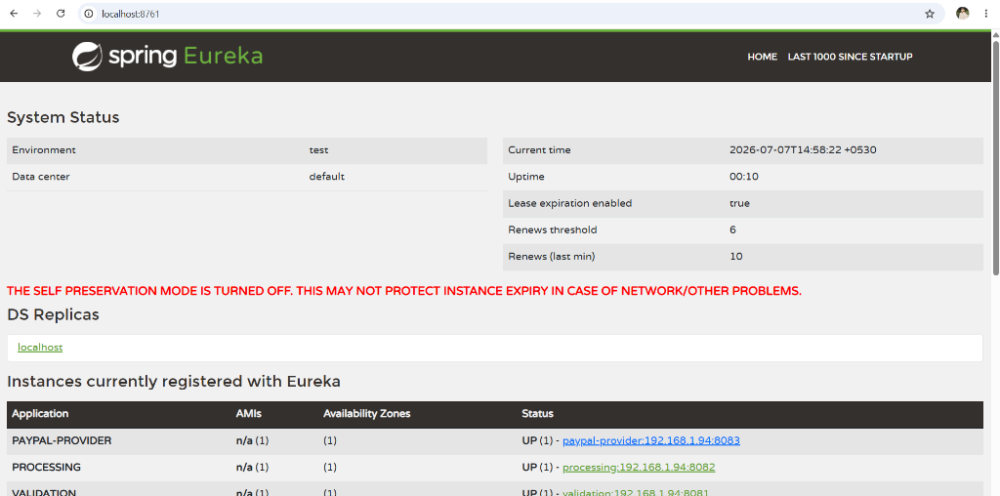
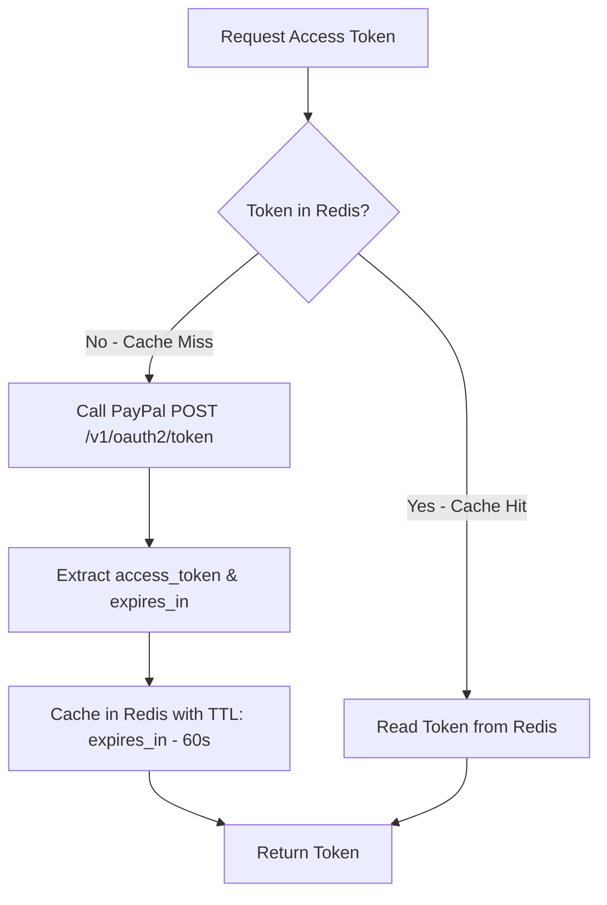
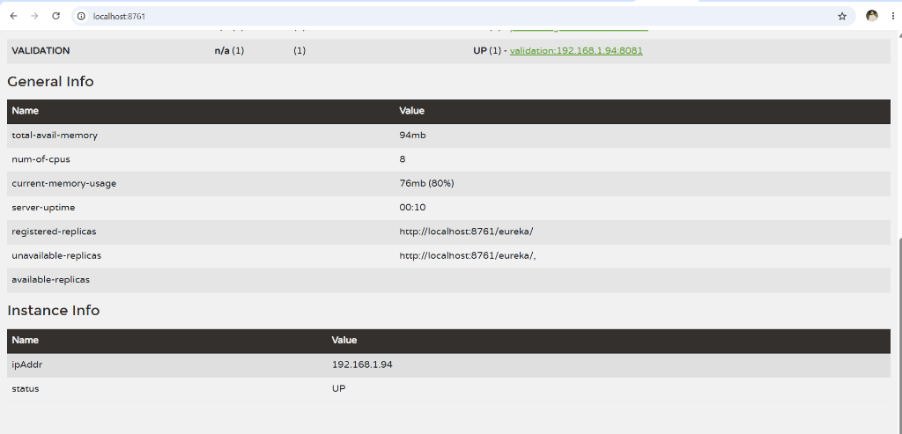
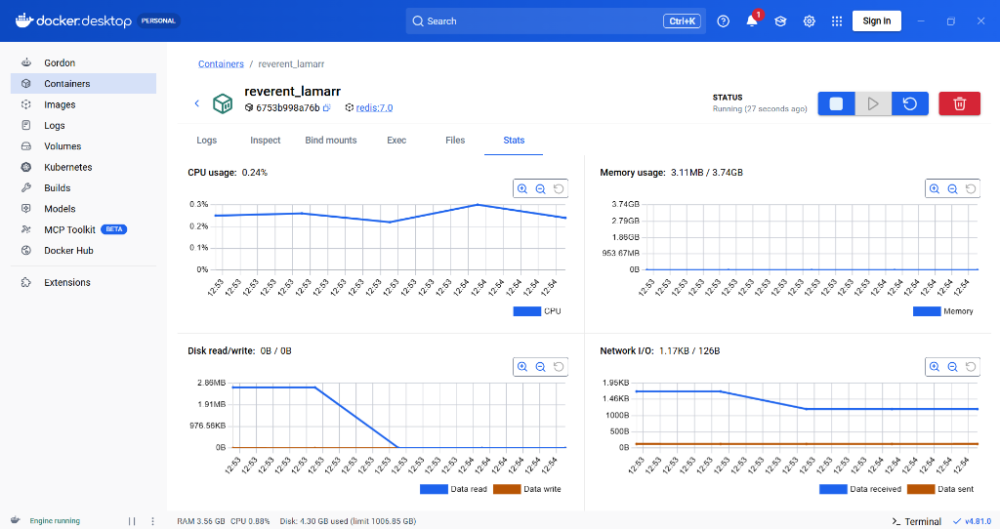
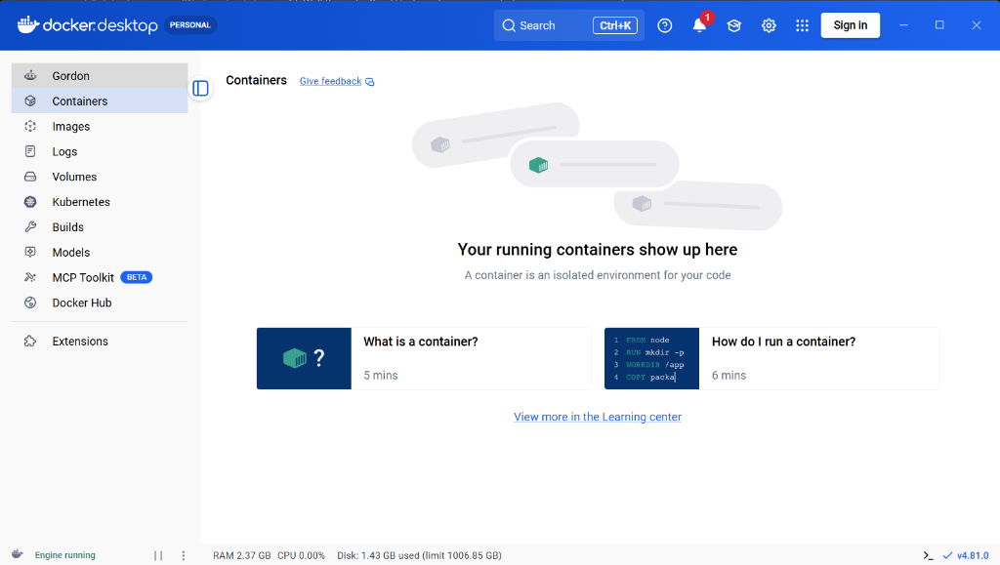

# PayPal Microservices Payment Gateway

A distributed payment gateway backend built using Spring Boot, Eureka Service Discovery, Redis Cache, and MySQL. This system coordinates multi-step payment flows (Create, Initiate, and Capture) using PayPal Sandbox REST APIs.

---

## System Architecture

The gateway is structured as a collection of microservices communicating inside a virtual container network managed by Docker Compose.



### Active Eureka Registry Dashboard

Below is the running Eureka Discovery Server dashboard displaying all three registered services (`PROCESSING`, `VALIDATION`, and `PAYPAL-PROVIDER`) in an `UP` status:





---

## Microservices Breakdown

| Service Directory | Port | Profile | Purpose |
| :--- | :--- | :--- | :--- |
| **`Eureka-Service-Registry`** | `8761` | `default` | Service discovery registry where all microservices register dynamically. |
| **`Payment Validation Service`** | `8081` | `local` / `docker` | Gateway entrypoint. Validates payload fields and routes calls to the processing coordinator. |
| **`Payment Processing Service`** | `8082` | `local` / `docker` | Orchestrates the payment state engine, updates the database, and communicates with payment adapters. |
| **`Paypal Provider Service`** | `8083` | `local` / `docker` | Adapter service that translates internal gateway requests to PayPal REST endpoints. |

---

## Detailed Directory and Code Structure

Below is the directory mapping of the project modules:

```text
Payment-System-main/
│
├── Eureka-Service-Registry/
│   ├── src/main/java/com/mycomp/eureka/EurekaApplication.java  # Registry startup
│   └── Dockerfile
│
├── Payment Validation Service/validation/
│   ├── src/main/java/com/mycomp/validation/
│   │   ├── controller/ValidationController.java                # Client REST controller
│   │   ├── exception/GlobalExceptionHandler.java               # Centralized HTTP error mapper
│   │   └── service/impl/ValidationServiceImpl.java             # Request constraint checker
│   └── pom.xml
│
├── Payment Processing Service/payments/
│   ├── src/main/java/com/mycomp/payments/
│   │   ├── controller/PaymentController.java                   # Inter-service receiver endpoint
│   │   ├── dao/impl/TransactionDaoImpl.java                    # Raw database queries (Spring JDBC)
│   │   ├── services/impl/statusprocessors/                     # Strategy pattern classes
│   │   │   ├── CreatedStatusProcessor.java                     # State: CREATED logic
│   │   │   ├── InitiatedStatusProcessor.java                   # State: INITIATED logic
│   │   │   ├── PendingStatusProcessor.java                     # State: PENDING logic
│   │   │   └── ApprovedStatusProcessor.java                    # State: APPROVED logic
│   │   └── services/factory/PaymentStatusFactory.java          # Factory mapping status IDs to processors
│   ├── src/main/resources/schema.sql                           # MySQL Table definitions
│   ├── src/main/resources/data.sql                             # Master statuses seed data
│   └── pom.xml
│
├── Paypal Provider Service/my paypal provider/
│   ├── src/main/java/com/mycomp/payments/
│   │   ├── controller/OrderController.java                     # REST Controller mapping requests
│   │   ├── service/TokenService.java                           # Redis token manager (OAuth)
│   │   └── service/impl/PaymentServiceImpl.java                # PayPal Order Create & Capture implementation
│   └── pom.xml
│
├── docker-compose.yml                                          # Core container orchestrator
└── .gitignore                                                  # Version control excludes
```

---

## Caching Strategy (Redis)

To limit external OAuth latency, `TokenService.java` is integrated with a Redis cache running on port `6379`.

### Token Fetch Workflow



During testing, you can check active caches by reviewing container logs for `paypal-provider-service`:
```text
2026-07-08T04:55:13.203Z INFO - Retrieving access token from TokenService
2026-07-08T04:55:13.204Z INFO - Returning cached access token from Redis
```

---

## Docker Environment Lifecycle Management

### Setup Prerequisites
*   Install **Docker Desktop** on Windows.
*   Verify command availability: `docker --version` and `docker compose version`

### Deployment Commands

1.  **Package Maven Artifacts**:
    Compile the Java code and package active profiles into targeted JARs before running docker:
    ```cmd
    # Run in the root containing mvnw
    .\mvnw.cmd clean package -DskipTests
    ```

2.  **Start Services**:
    Build the container images and launch the stack in the background:
    ```cmd
    docker compose up --build -d
    ```

3.  **Check Service Statuses**:
    Verify that all 6 containers (`eureka`, `mysql`, `redis`, `validation`, `processing`, and `paypal-provider`) are `Up`:
    ```cmd
    docker compose ps
    ```
    *Note: The MySQL container maps to port `3308` on the host machine to prevent port collisions with any local running MySQL instance.*

### Docker Desktop Container Orchestration

You can monitor and manage the running containers and resource consumption directly within the Docker Desktop GUI:





4.  **Trace Application Logs**:
    Observe live logging streams:
    ```cmd
    docker compose logs -f
    ```

5.  **Shutdown and Clean Volumes**:
    Stop containers and remove runtime storage configurations:
    ```cmd
    docker compose down -v
    ```

---

## Database Schema & Master Seed Verification

The database tables and status configurations initialization inside MySQL Workbench:



---

## REST API Specifications

### 1. Initiate Payment Flow
*   **Endpoint**: `POST http://localhost:8081/validation/createPayment`
*   **Request Body**:
    ```json
    {
      "userId": 302,
      "paymentMethodId": 1,
      "providerId": 1,
      "paymentTypeId": 1,
      "amount": 100.50,
      "currency": "USD",
      "merchantTransactionReference": "TXN-101"
    }
    ```
*   **Response Payload**:
    ```json
    {
      "txnReference": "f4309887-ce34-4c35-a94b-b417ef98736c",
      "txnStatusId": 3,
      "redirectUrl": "https://www.sandbox.paypal.com/checkoutnow?token=63V23857FS7491321",
      "providerReference": "63V23857FS7491321"
    }
    ```

### 2. Capture Completed Order
*   **Endpoint**: `POST http://localhost:8081/validation/{txnReference}/completePayment`
    *(Use the `txnReference` generated in step 1)*

---

## Future Enhancements

*   **Automatic Reconciliation Scheduler**: Implement a periodic Spring Batch/Scheduler task to check for transactions remaining in State `4` (APPROVED) or `3` (PENDING) and automatically capture them by querying PayPal status.
*   **API Gateway Integration**: Construct a Spring Cloud Gateway module on port `8080` to act as the single traffic entrypoint for rate-limiting and JWT security.
*   **RabbitMQ / Kafka Messaging**: Transition HTTP inter-service logging to asynchronous events via an MQ broker.
*   **Multiple Providers**: Extend database mappings and factory loaders to support Stripe APIs.
*   **AWS Orchestration**: Configure ECS/EKS deployments with Secrets Manager configurations.
*   **Frontend Implementation**: Build a user interface/dashboard portal for payment processing status tracking.
*   **JWT Authentication**: Secure internal microservices communication and gateway endpoints.
*   **Kubernetes Deployment**: Orchestrate microservices using Kubernetes manifests.
*   **AWS Cloud Deployment**: Deploy services on AWS EC2 instances, RDS databases, and Secrets Manager.

---

### Author
**Rohit Singh**
*Java Backend Developer | Spring Boot | Microservices | Docker*
